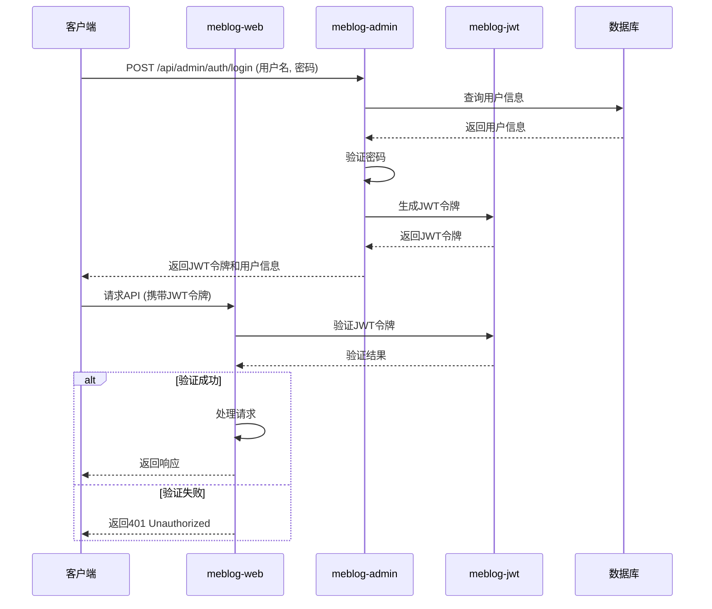
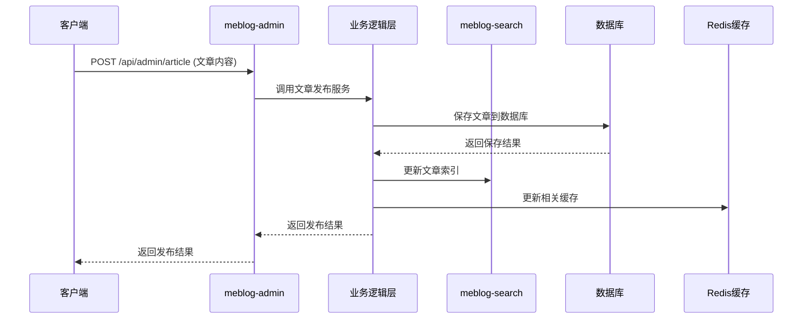
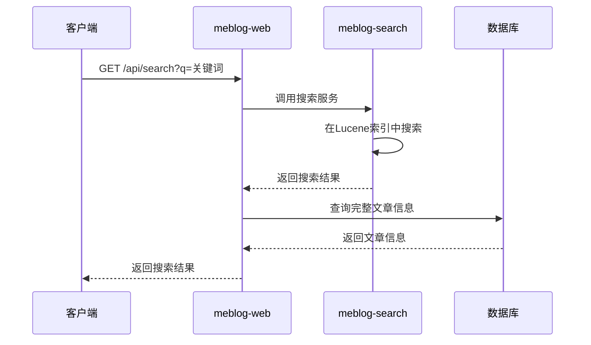

# 系统架构

Meblog-Java采用了清晰的分层架构和模块化设计，系统结构合理，易于扩展和维护。本章将详细介绍Meblog-Java的系统架构，包括模块划分、分层设计、核心流程和数据库设计等。

## 1. 系统架构概述

Meblog-Java采用了经典的三层架构设计，并结合了模块化开发思想，主要包括：

- **表现层**：处理HTTP请求和响应，提供RESTful API
- **业务逻辑层**：实现核心业务逻辑
- **数据访问层**：与数据库交互
- **基础设施层**：提供通用组件和服务

系统采用多模块设计，各模块之间低耦合，便于独立开发、测试和部署。

## 2. 模块划分

Meblog-Java项目分为以下几个核心模块：

| 模块名称 | 模块职责 | 主要功能 |
|----------|----------|----------|
| meblog-web | 主应用模块 | 处理前端HTTP请求，提供博客系统的核心API |
| meblog-admin | 管理后台模块 | 提供管理后台的API，包括用户管理、文章管理等 |
| meblog-common | 公共模块 | 提供通用的工具类、模型、异常处理等 |
| meblog-jwt | JWT认证模块 | 实现JWT的生成、验证和解析功能 |
| meblog-search | 搜索模块 | 基于Lucene实现全文搜索功能 |

### 2.1 模块依赖关系

```
meblog-web
├── meblog-common
├── meblog-jwt
└── meblog-search

meblog-admin
├── meblog-common
└── meblog-jwt

meblog-search
└── meblog-common

meblog-jwt
└── meblog-common
```

### 2.2 模块详细介绍

#### 2.2.1 meblog-web 模块

meblog-web是系统的主应用模块，主要负责处理前端HTTP请求，提供博客系统的核心API。

**核心功能：**
- 文章管理API
- 分类与标签管理API
- 搜索API
- 统计API
- 博客设置API
- Wiki API

**主要包结构：**
```
cn.iswxl.meblog.web
├── config          # 配置类
├── controller      # 控制器
├── convert         # 对象转换
├── service         # 业务逻辑
├── utils           # 工具类
└── MeblogWebApplication.java  # 应用入口
```

#### 2.2.2 meblog-admin 模块

meblog-admin是系统的管理后台模块，主要负责提供管理后台的API，包括用户管理、文章管理等。

**核心功能：**
- 用户管理API
- 角色管理API
- 权限管理API
- 文章管理API
- 分类与标签管理API
- 文件管理API
- 博客设置API
- Wiki管理API

**主要包结构：**
```
cn.iswxl.meblog.admin
├── config          # 配置类
├── controller      # 控制器
├── convert         # 对象转换
├── runner          # 初始化运行器
├── schedule        # 定时任务
├── service         # 业务逻辑
└── utils           # 工具类
```

#### 2.2.3 meblog-common 模块

meblog-common是系统的公共模块，提供通用的工具类、模型、异常处理等。

**核心功能：**
- 通用工具类
- 通用模型
- 异常处理
- 常量定义
- 配置类

#### 2.2.4 meblog-jwt 模块

meblog-jwt是系统的JWT认证模块，实现JWT的生成、验证和解析功能。

**核心功能：**
- JWT生成
- JWT验证
- JWT解析

#### 2.2.5 meblog-search 模块

meblog-search是系统的搜索模块，基于Lucene实现全文搜索功能。

**核心功能：**
- 索引创建
- 索引更新
- 索引删除
- 全文搜索

## 3. 分层架构设计

Meblog-Java采用了清晰的分层架构设计，主要包括：

### 3.1 表现层

表现层主要负责处理HTTP请求和响应，提供RESTful API。

**核心组件：**
- Spring MVC控制器
- RequestMapping和RestController注解
- 统一响应格式
- 异常处理

**设计原则：**
- 只负责接收请求和返回响应
- 不包含业务逻辑
- 进行参数校验
- 统一响应格式

### 3.2 业务逻辑层

业务逻辑层主要负责实现核心业务逻辑。

**核心组件：**
- Service接口和实现类
- 事务管理
- 业务规则实现

**设计原则：**
- 实现核心业务逻辑
- 处理业务规则和约束
- 进行事务管理
- 调用数据访问层

### 3.3 数据访问层

数据访问层主要负责与数据库交互。

**核心组件：**
- MyBatis Plus Mapper接口
- 实体类
- SQL语句

**设计原则：**
- 只负责数据库操作
- 不包含业务逻辑
- 提供CRUD操作
- 支持事务

### 3.4 基础设施层

基础设施层主要负责提供通用组件和服务。

**核心组件：**
- Redis缓存
- Lucene搜索
- Minio文件存储
- JWT认证
- 日志管理

**设计原则：**
- 提供通用服务
- 与业务逻辑解耦
- 便于替换和扩展

## 4. 核心流程设计

### 4.1 用户认证流程



### 4.2 文章发布流程



### 4.3 全文搜索流程



## 5. 数据库设计

### 5.1 数据库表结构

Meblog-Java的数据库设计遵循了规范化原则，主要包括以下核心表：

| 表名 | 用途 | 核心字段 |
|------|------|----------|
| sys_user | 用户表 | id, username, password, email, role_id |
| sys_role | 角色表 | id, name, description |
| sys_permission | 权限表 | id, name, code, url |
| sys_role_permission | 角色权限关联表 | role_id, permission_id |
| article | 文章表 | id, title, content, summary, category_id, view_count |
| category | 分类表 | id, name, parent_id, level, sort |
| tag | 标签表 | id, name |
| article_tag | 文章标签关联表 | article_id, tag_id |
| file | 文件表 | id, name, path, size, type |
| blog_settings | 博客设置表 | id, key, value, description |
| wiki | Wiki表 | id, title, content, parent_id, sort |
| statistics | 统计表 | id, type, value, date |

### 5.2 表关系图

```mermaid
erDiagram
    sys_user ||--o{ sys_role : has
    sys_role ||--o{ sys_permission : has
    sys_role ||--o{ sys_role_permission : "many to many"
    sys_permission ||--o{ sys_role_permission : "many to many"
    article ||--o{ category : belongs to
    article ||--o{ article_tag : "many to many"
    tag ||--o{ article_tag : "many to many"
    wiki ||--o{ wiki : has parent
```

## 6. 缓存设计

Meblog-Java使用Redis作为缓存，主要缓存以下内容：

| 缓存类型 | 缓存内容 | 过期时间 | 刷新策略 |
|----------|----------|----------|----------|
| 文章缓存 | 热门文章、最新文章 | 5分钟 | 文章更新时刷新 |
| 分类标签缓存 | 分类列表、标签列表 | 30分钟 | 分类标签更新时刷新 |
| 用户缓存 | 用户信息、权限信息 | 1小时 | 用户登录或权限变更时刷新 |
| 统计缓存 | 实时统计数据 | 10分钟 | 定时任务刷新 |

## 7. 安全设计

### 7.1 认证机制

- 基于JWT的无状态认证
- 密码采用BCrypt加密存储
- 支持令牌刷新机制

### 7.2 授权机制

- 基于RBAC（基于角色的访问控制）模型
- 支持接口级别的权限控制
- 支持动态权限分配

### 7.3 防护措施

- SQL注入防护（MyBatis参数化查询）
- XSS攻击防护（输入输出过滤）
- CSRF攻击防护（JWT无状态设计）
- 接口请求频率限制
- 敏感信息加密存储

## 8. 部署架构

### 8.1 单机部署

```
+----------------+    +----------------+    +----------------+
|   Nginx        |    |   Redis        |    |   Minio        |
|   反向代理      |    |   缓存数据库    |    |   对象存储      |
+-------+--------+    +----------------+    +----------------+
        |
        v
+-------+--------+
|   Meblog-Java  |
|   应用服务器    |
+-------+--------+
        |
        v
+-------+--------+
|   MySQL        |
|   关系型数据库  |
+----------------+
```

### 8.2 分布式部署

```
+----------------+    +----------------+    +----------------+
|   Nginx        |    |   Redis Cluster|    |   Minio Cluster|
|   负载均衡      |    |   缓存集群      |    |   对象存储集群  |
+-------+--------+    +----------------+    +----------------+
        |
        +--------------------------------+
        |                                |
        v                                v
+-------+--------+                +-------+--------+
|   Meblog-Java  |                |   Meblog-Java  |
|   应用服务器1   |                |   应用服务器2   |
+-------+--------+                +-------+--------+
        |                                |
        +--------------------------------+
        |
        v
+-------+--------+
|   MySQL Cluster|
|   数据库集群    |
+----------------+
```

## 9. 扩展性设计

### 9.1 模块化设计

- 采用多模块架构，各模块之间低耦合
- 支持独立部署和升级
- 便于功能扩展和定制

### 9.2 插件化支持

- 设计了插件扩展机制
- 支持动态加载和卸载插件
- 便于第三方扩展功能

### 9.3 配置驱动

- 采用配置驱动设计
- 支持动态配置更新
- 便于系统调整和优化

## 10. 性能优化

### 10.1 数据库优化

- 合理的索引设计
- 数据库连接池优化
- 读写分离（预留功能）
- 分库分表（预留功能）

### 10.2 缓存优化

- 多级缓存策略
- 合理的缓存过期时间
- 缓存预热机制
- 缓存雪崩、穿透、击穿防护

### 10.3 代码优化

- 异步处理
- 批量操作
- 延迟加载
- 减少网络请求

### 10.4 部署优化

- 负载均衡
- 垂直扩展和水平扩展
- CDN加速（预留功能）

## 11. 架构总结

Meblog-Java采用了清晰的分层架构和模块化设计，系统结构合理，易于扩展和维护。通过使用Spring Boot、Spring Security、Redis、Lucene、Minio等技术，Meblog-Java实现了一个功能完整、安全可靠、高性能的博客系统后端框架。

系统的架构设计充分考虑了性能、安全性、可扩展性和可维护性，同时也考虑了未来的发展和演进。这种架构设计使得Meblog-Java既适合个人博客系统，也适合企业级应用场景。

随着技术的不断发展，Meblog-Java也将持续升级和演进，采用更先进的技术和架构，提供更好的性能和用户体验。